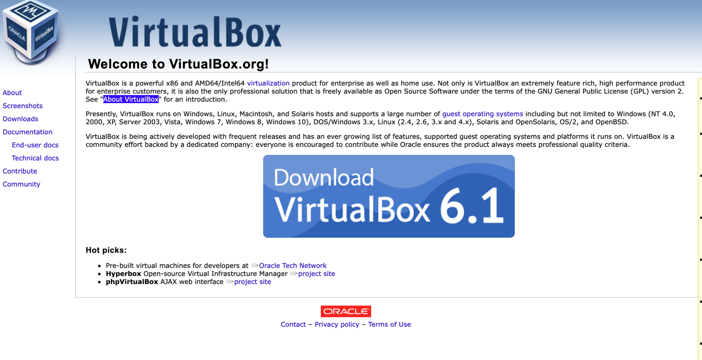
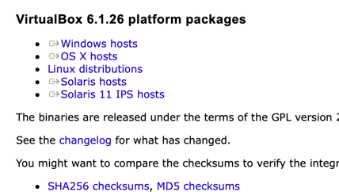

# 테스트 환경 구성하기


책에서는 코드형 인프라로 인프라 환경을 일정하게 유지하고 구성

* 코드형 인프라 : 코드로 하드웨어 설정, 운영체제 설치, 네트워크 구성, 개발환경 구축 


# 테스트 환경을 자동으로 구성하는 도구 

* 베이그런트, 버추얼박스

### 버추얼박스 설치

* 이노테크에서 개발한 가상화 소프트웨어로 오라클에서 배포.
* 대부분 운영체제를 게스트 운영체제로 사용할 수 있고, 확장팩을 제외하면 아무제한없이 SW의 모든 기능 무료
* 다른 가상화 소프트웨어보다 기능이 강력하고 안정적 

### 맥(MAC OS)에서 설치

* https://www.virtualbox.org 버추얼박스 공식 사이트 접속
*  
  * Download 클릭
* 
  * OS X hosts 클릭하여 다운로드  
  * 다운로드 후 pkg 파일 실행하여 설치.


### 베이그런트 설치

* https://www.vagrantup.com/downloads
* 참고 : https://www.44bits.io/ko/post/vagrant-tutorial
* or 
```shell
brew tap hashicorp/tap
brew install vagrant
```

*베이그런트는 독립적으로 사용되는 도구가 아니며, 가상 머신을 생성하거나 조작하는 기능을 직접 제공하지는 않습니다. 베이그런트에는 프로바이더라는 개념이 있어서 버추얼박스VirtualBox, VMWare, 도커Docker, Hyper-V와 같은 도구들을 가상 머신을 관리하는 도구로 조합해서 사용할 수 있습니다.*

* 이러한 특징은 이후에 개발된 하시코프 도구들에서도 찾아볼 수 있는 매우 중요한 컨셉입니다. 예를 들어 인프라스트럭처를 코드로 관리할 수 있게 도와주는 테라폼에는 프로바이더 개념이 있습니다. AWS 프로바이더, GCP 프로바이더, Azure 프로바이더 등 메이저 클라우드 서비스를 지원할 뿐만 아니라 테라폼에서 사용 가능한 다양한 서비스의 프로바이더가 개발되고 있습니다.

* 베이그런트는 공식적으로 맥OS*, 윈도우, 리눅스를 지원하며, 다운로드 페이지에서 운영체재 별 최신 버전을 다운로드 할 수 있습니다. 또한 하시코프 릴리스 페이지에서 과거 버전들을 다운로드할 수 있습니다.

* 2021년 1월 현재 애플 실리콘 M1 기반의 맥북에서는 가상 머신 도구들이 지원하지 않아 정상적으로 사용이 불가능한 것으로 보입니다.

#### 자주 사용하는 베이그런트 명령어
* vagrant init : 프로비저닝을 위한 기초 파일 생성
* vagrant up : Vagrantfile을 읽어 들여 프로비저닝을 진행
* vagrant halt : 베이그런트에서 다루는 가상 머신 종료
* vagrant destroy : 관리하는 가상 머신 삭제
* vagrant ssh : 관리하는 가상 머신에 ssh로 접속
* vagrant provision : 관리하는 가상 머신에 변경된 설정 적용

### 베이그런트 구성 및 테스트
베이그런트 프로비저닝 코드를 개인이 원하는 위치해 구현해 사용 가능.  
디렉토리를 하나 만들어서 그 안에 구성해봄.  

1. 디렉토리에서 vagrant init 명령을 실행해 프로비저닝에 필요한 기본 코드 생성
  * Vagrantfile이 하나 생김

2. Vagrantfile을 에디터 프로그램이나 vi/vim으로 열고 파일에서 config.vm.box = "base"라는 내용이 있는지 확인 
  * 10~17줄 사이에있음

3. https://app.vagrantup.com/boxes/search에 접속하여 가상이미지를 받아야함
  * 검색창에 sysnet4admin을 검색하면 저자가 올려둔 파일이 보임 
  * CentOs-k8s 
4. config.vm.box = "base" 를 config.vm.box = "sysnet4admin/CentOS-k8s"로 변경 후 저장(wq!)

5. vagrant up 명령어 실행 후 가상 머신 이미지를 내려받는지 확인 

* `Vagrant was unable to mound VirtualBox shared folders' 오류는 버추얼박스 게스트 에디션이 설치되지 않아서 발생한 에러
  * 크게 신경 안써도된다.  
```shell
 ysk 🐸   ~/Documents/study/kubernetes/vagrant_ys  vagrant up
Bringing machine 'default' up with 'virtualbox' provider...
==> default: Box 'sysnet4admin/CentOS-k8s' could not be found. Attempting to find and install...
    default: Box Provider: virtualbox
    default: Box Version: >= 0
==> default: Loading metadata for box 'sysnet4admin/CentOS-k8s'
    default: URL: https://vagrantcloud.com/sysnet4admin/CentOS-k8s
==> default: Adding box 'sysnet4admin/CentOS-k8s' (v0.7.4) for provider: virtualbox
    default: Downloading: https://vagrantcloud.com/sysnet4admin/boxes/CentOS-k8s/versions/0.7.4/providers/virtualbox.box
==> default: Successfully added box 'sysnet4admin/CentOS-k8s' (v0.7.4) for 'virtualbox'!
==> default: Importing base box 'sysnet4admin/CentOS-k8s'...
==> default: Matching MAC address for NAT networking...
==> default: Checking if box 'sysnet4admin/CentOS-k8s' version '0.7.4' is up to date...
==> default: Setting the name of the VM: vagrant_ys_default_1629429732397_28423
Vagrant is currently configured to create VirtualBox synced folders with
the `SharedFoldersEnableSymlinksCreate` option enabled. If the Vagrant
guest is not trusted, you may want to disable this option. For more
information on this option, please refer to the VirtualBox manual:

  https://www.virtualbox.org/manual/ch04.html#sharedfolders

This option can be disabled globally with an environment variable:

  VAGRANT_DISABLE_VBOXSYMLINKCREATE=1

or on a per folder basis within the Vagrantfile:

  config.vm.synced_folder '/host/path', '/guest/path', SharedFoldersEnableSymlinksCreate: false
==> default: Clearing any previously set network interfaces...
==> default: Preparing network interfaces based on configuration...
    default: Adapter 1: nat
==> default: Forwarding ports...
    default: 22 (guest) => 2222 (host) (adapter 1)
==> default: Booting VM...
There was an error while executing `VBoxManage`, a CLI used by Vagrant
for controlling VirtualBox. The command and stderr is shown below.

Command: ["startvm", "f3552f54-1d21-4ae1-a29a-30984055ba1b", "--type", "headless"]

Stderr: VBoxManage: error: The virtual machine 'vagrant_ys_default_1629429732397_28423' has terminated unexpectedly during startup with exit code 1 (0x1)
VBoxManage: error: Details: code NS_ERROR_FAILURE (0x80004005), component MachineWrap, interface IMachine

 ✘ ysk 🐸   ~/Documents/study/kubernetes/vagrant_ys 
```

6. 설치가 끝나면 버추얼박스를 실행해 가상 머신이 제대로 생성됐는지 확인 
  * Kernel driver not installed (rc=-1908) 오류가 날시에 아래 참고
  * https://hyunsoft.tistory.com/207
7. 명령 프롬프트(터미널)로 돌아와 vagrant ssh 명령을 실행해 설치된 CentOS에 접속 


