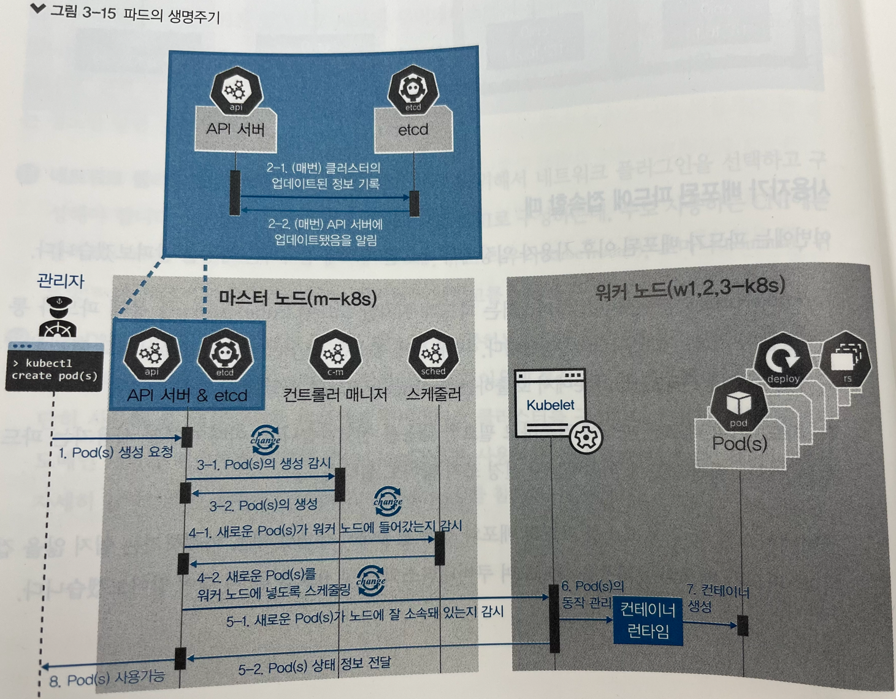

# 컨테이너를 이루는 표준 아키텍처 쿠버네티스

* 컨테이너 인프라 환경 : 리눅스 os의 커널 하나에서 여러개의 컨테이너가 격리된 상태로 실행되는 인프라 환경
  * 컨테이너: 하나 이상의 목적을 위해 독립적으로 작동하는 프로세스  
* os 커널 하나에 컨테이너 여러개가 격리된 형태로 실행되기 때문에 자원을 효율적으로 사용할 수 있고 거치는 단계가 적어서 속도도 훨씬 빠르다.

* 쿠버네티스는 `컨테이너 오케스트레이션`을 위한 솔루션
* 컨테이너 오케스트레이션 : 복잡한 단계를 관리하고 요소들의 관계를 미리 정의해 손쉽게 사용하도록 서비스를 제공하는 것
  * 다수의 컨테이너를 유기적으로 연결, 실행, 종료
  * 상태를 추적하고 보존하는것

* 쿠버네티스 장단점 
  * 사용 편의성 : 좋음
  * 세부 설정 지원 : 다양함
  * 안전성 : 매우 안정적
  * 확장성 : 매우 잘 됨
  * 정보량 : 매우 많음
  * 에코 파트너 : 매우 많음
  * 설치 난이도 : 어려움
  * 학습 곡선 : 어려움

### k8s : 쿠버네티스의 약어 

# 쿠버네티스 구성 방법

1. 클라우드 업체에서 제공하는 관리형 쿠버네티스
    1. EKS (Amazon Elastic Kubernetes Service)
    2. GKE (Goole Kubernetes Engine) 등
    * 마스터 노드를 클라우드 업체에서 관리함. 

2. 수세의 Rancher, 레ㅔ드햇의 OpenShift와 같은 플랫폼에서 제공하는 설치형 쿠버네티스. 유료다

3. 쿠버네티스 클러스터를 자동으로 구성해주는 솔루션
    1. kubeadm
    2. kops
    3. KRIB
    4. kubespray

# 쿠버네티스 구성

* kubeadm 으로 쿠버네티스를 구성할 것이다. 
* 서버 노드는 가상 머신을 이용해 실제 온프레미스에 가깝게 구성
* 설치되는 과정을 베이그런트로 자동화해 테스트 환경 구성

* 저자의 깃허브에서 스크립트와 소스코드 내려받는다
  * https://github.com/sysnet4admin/_Book_k8sInfra 

### 쿠버네티스 구성 요소

* kubectl, kubelet, API 서버, 캘리코 등 모두 쿠버네티스 클러스터를 이루는 구성 요소
* etcd, 컨트롤러 매니저, 스케줄러, kube-proxy, 컨테이너 런타임, 파드 등이 있다.
* 파드(pod) : 쿠버네티스에서 생성하고 관리할 수 있는 배포가능한 가작 작은 컴퓨팅 단위 

* 쿠버네티스 클러스터에 마스터 노드와 워커 노드들 연결 확인 명령어
  * kubectl get nodes 
    * 루트로 로그인 해야함 
#### 쿠버네티스 구성 요소의 이름 생성 규칙
* 쿠버네티스의 구성 요소는 동시에 여러개가 존재하는 경우 중복된이름을 피하려고 뒤에 해시코드가 삽입 된다(이 때 해시 코드는 무작위 문자열로 생성)
* ex: kube-proxy-5ldsfxoe

### 관리자나 개발자가 파드를 배포할 때

* 쿠버네티스 구성요소간 통신 

1. 0 kubectl : 쿠버네티스 클러스터에 명령을 내리는 역할. 주로 API서버와 통신함
2. 1 API서버 : 쿠버네티스 클러스터의 중심 역할을 하는 통로. 모든 상황을 관리하고 목표를 설정함
3. 2 etcd : 구성요소들의 상태 값이 모두 저장되는곳. etcd 외의 다른 구성 요소는 상태값을 관리하지 않는다. 
        * 분산 저장이 가능한 key-value 저장소이다. 
4. 3 컨트롤러 매니저 : 쿠버네티스 클러스터의 오브젝트 상태를 관리한다. 워커 노드에서 통신이 되지 않는 경우 상태 체크와 복구는 컨트롤러 매니저에 속한 노드 컨트롤러에서 이루어짐.
    * 서비스와 파드를 연결하는 역할을 하는 엔드 포인트 컨트롤러
5. 4 스케줄러 : 노드의 상태와 자원, 레이블, 요구 조건 등을 고려해 파드를 어떤 워커 노드에 생성할것인지를 결정하고 할당.
6. 5 kubelet : 파드의 구성 내용(PodSpec)을 받아서 컨테이너 런타임으로 전달하고 컨테이너들이 정상적으로 작동하는지 모니터링
7. 6 컨테이너 런타임 : 파드를 이루는 컨테이너의 실행을 담당. 파드 안에서 다양한 종류의 컨테이너가 문제 없이 작동하게 만드는 표준 인터페이스.
8. 7 `파드(Pod)` : 한개 이상의 컨테이너. 단일 목적의 일을 하기 위해서 모인 단위.
    * 웹 서버 역할을 할 수도 있고, 로그나 데이터를 분석할 수도 있다.
    * 파드는 언제라도 죽을 수 있는 존재.
9. 11 네트워크 플러그인 : 쿠버네티스 클러스터의 통신을 위해서 네트워크 플러그인을 선택하고 구성한다.
10. 12 CoreDNS: 빠르고 유연한 DNS 서버. 클러스터에서 도메인 이름을 이용해 통신하는데 사용 

### 사용자가 배포된 파드에 접속할 때 과정

1. kube-proxy : 쿠버네티스 클러스터는 파드가 위치한 노드에 kube-proxy를 통해 파드가 통신할 수 있는 네트워크를 설정합니다
    * 이 때 실제 통신은 br_netfilter와 iptables로 관리 
   
2. 파드 : 이미 배포된 파드에 접속하고 필요한 내용을 전달받습니다. 이 때 대부분 사용자는 파드가 어느 워커 노드에 위치하는지 신경쓰지 않아도 된다. 

# 파드의 생명주기로 쿠버네티스 구성 요소 살펴보기. 

쿠버네티스의 가장 큰 장점은 쿠버네티스의 구성요소마다 하는 일이 명확하게 구분돼 각자의 역할만 충실하게 수행하면 시스템이 안정적으로 운영된다는 점이다.  

* 
* 파드의 생명주기 - 생성 - 수정 - 삭제
1. kubelctl을 통해 API 서버에 파드 생성 요청 : create pod
2. 업데이트가 있을때마다 매번 API 서버에 전달된 내용이 있으면 API 서버는 etcd에 전달된 내용을 모두 기록해 크,ㄹ러스터의 상태 값을 최신으로 유지.
    * 따라서 각 요소가 상태를 업데이트 할 때마다 모두 API 서버를 통해 etcd에 기록 
3. API 서버에 파드 생성이 요청된 것을 컨트롤러 매니저가 인지하면 컨트롤러 매니저는 파드를 생성하고 이 상태를 API 서버에 전달.
    * 이 때, 어떤 워커 노드에 파드를 적용할지는 결정되지 않은 상태로 파드만 생성 
4. API 서버에 파드가 생성됐다는 정보를 스케줄러가 인지. 스케줄러는 생성된 파드를 어떤 워커노드에 적용할지 조건을 고려해 결정하고 해당 워커 노드에 파드를 띄우도록 요청
5. API 서버에 전달된 정보대로 지정한 워커 노드에 파드가 속해있는지 스케줄러가 kubelet으로 확인
6. kubelet에서 컨테이너 런타임으로 파드 생성 요청
7. 파드 생성
8. 파드가 사용 가능한 상태가 됨 

> 쿠버네티스는 작업을 순서대로 진행하는 워크플로 구조가 아니라,  
> 선언적인 시스템 구조를 가지고 있다.  
> 각 요소가 추구하는 상태를 선언하면 현재 상태와 맞는지 점검하고 그것에 맞추려고 노력하는 구조로 되어있다.

* 따라서, 추구하는 상태를 API 서버에 선언하면 다른 요소들이 API 서버에 와서 현재 상태와 비교하고 그에 맞게 상태를 변경하려고 한다.

### 3.1.6 쿠버네티스 구성 요소의 역할과 의미

