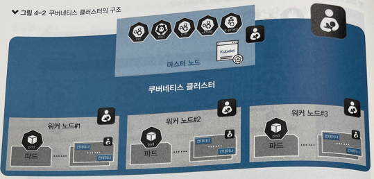
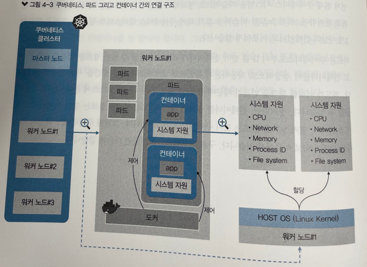
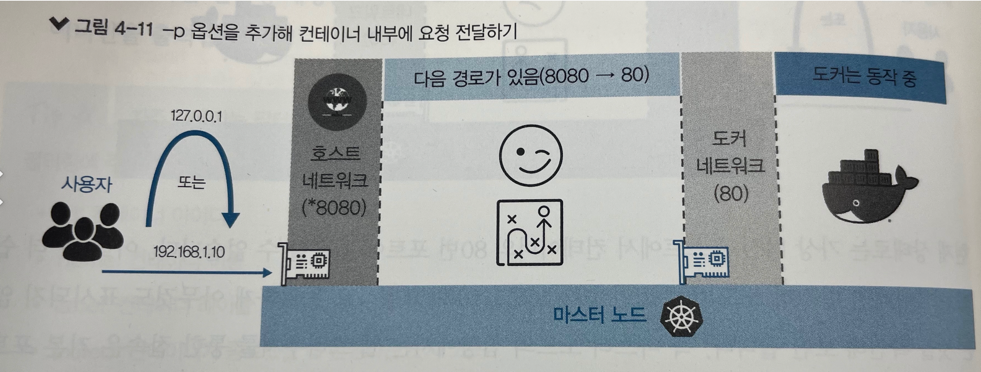

# 4장, 쿠버네티스를 이루는 컨테이너 도우미, 도커
---

* 쿠버네티스를 이루는 기본 오브젝트 = 파드(pod)
* 파트는 컨테이너로 이루어져 있다.
* `컨테이너`를 만들고 관리하는 도구 : 도커 

* 쿠버네티스 시스템을 구성하고 있는것들
  * 워커 노드라는 노드단위로 관리
  * 워커 노드와 마스터 노드가 모여 쿠버네티스 클러스터가 된다
  * 파드(pod)는 1개 이상의 컨테이너로 이루어져 있다. 
    * 파드는 쿠버네티스로부터 IP를 받아 컨테이너가 외부와 통신할 수 있는 경로를 제공한다. 

### 컨테이너를 돌보는 것이 파드고, 파드를 돌보는 것이 쿠버네티스 워커 노드이며, 워커노드를 돌보는 것이 쿠버네티스 마스터다 

* 

* 컨테이너 : 하나의 운영 체제 안에서 커널을 공유하며 개별적인 실행 환경을 제공하는 격리된 공간

* 

* 도커의 구성 : 명령어를 입력하는 명령어 도구 + 명령어를 받아들이는 도커 데몬 

## 4.2 도커로 컨테이너 다루기

### 이미지 검색하고 내려받기 
* 이미지는 registry라고 하는 저장소에 모여있다.
* docker hub(https://hub.docker.com)처럼 유명 레지스트리 or 내부 구축 레지스트리 일수도 있따. 

* docker search 명령어 (ex: docker search nginx) 
  * 표시되는 각 열의 이미 
    * INDEX : 저장된 레지스트리의 이름
    * NAME: 검색된 이미지의 이름. 공식 이미지를 제외한 나머지는 레지스트리주소 / 저장소 소유자 / 이미지 이름
    * DESCRIPTION : 이미지 설명
    * STARTS: 사용자에게 받은 평가 횟수 
    * OFFICIAL: [OK] 표시는 해당 이미지를 개발한 업체에서 공식적으로 제공한단 의미 
    * AUTOMATED: 도커 허브에서 자체적으로 제공하는 이미지 빌드 자동화 기능을 활용해 생선한 이미지를 의미 

* docker full : 이미지를 내려받을 때 사용하는 명령어 ex) docker full nginx
  * 이미지 태그가 latest면 최신 버전 이미지다 
    *  컨테이너를 배포할 때는 latest 태그가 아닌 검증된 버전으로 배포해야 문제가 생기지 않는다. 

### 컨테이너 실행하기

* ex ) docker run -d --restart always nginx 
* docker run [옵션] <사용할 이미지 이름> [:태그 | @다이제스트] // 태그와 다이제스트는 생략 가능 
  * -d(--detach) : 컨테이너를 백그라운드에서 구동한다는 의미. 옵션을 생략하면 컨테이너 내부에서 실행되는 애플리케이션의 상태가 화면에 계속 표시된다. 
    * 컨트롤 + c 를 누르면 컨테이너 중단 
  * --restart always: 컨테이너의 재시작과 관련된 정책 의미 옵션 
    * 중지된 컨테이너를 즉시 재시작 하거나 리눅스 시스템에서 도커 서비스 작동시 컨테이너 자동 시작
      * --restart 옵션들
        * no : 비정상 종료시 재시작 x 서비스 시작시 시작 x
        * on-failure : 비정상 종료시 재시작 o 시작시 시작 o
        * always : 비정상 종료시 재시작 o 시작시 시작 o 
        * unless-stopped : 비정상 종료시 재시작 o 사용자가 직접 정지하지 않는 컨테이너만 시작 

* docker ps 명령어 : 도커 프로세서 상태 의미  
  * CONTAINER ID: 컨테이너 고유 ID
  * IMAGE : 컨테이너를 만드는데 사용한 이미지
  * COMMAND : 컨테이너가 생성될 때 내부에서 작동할 프로그램을 실행하는 명령어 
  * CREATED : 컨테이너 생성 시각
  * STATUS : 컨테이너가 작동을 시작한 시각 
  * PORTS : 포트와 프로토콜 
  * NAMES: 컨테이너 이름 표시
    * docker run --name 옵션 으로 지정 가능 
  * docker ps -f id='' 로 컨테이너 지정 검색가능 
    * 자주 사용하는 키들
      * id : 아이디
      * name : 이름
      * label : 컨테이너 레이블
      * exited : 종료됐을 떄 반환하는 숫자 코드
      * status : 작동 상태
      * ancestor : 사용하는 이미지 

> 컨테이너는 변경 불가능한 인프라를 지향. 초기에 인프라를 구성하면 임의로 디렉토리 연결이나 포트 노출과 같은 설정을 변경할 수 없다.  
> 컨테이너에 적용된 설정을 변경하려면 새로운 컨테이너를 생성해야 한다.   
> 이러한 특성 덕분에 컨테이너로 배포된 인프라는 배포된 상태를 유지 

* `응답을 컨테이너에서 처리해주기를 원한다면 컨테이너에서 받아줄 수 있는 포트로 연결해 주는 설정이 필요`
* docker run -d -p 8080:80 --name nginx-exposed --restart always nginx
  * -p(publish) : 외부에서 호스트로 보낸 요청을 컨테이너 내부로 전달하는 옵션  
    * -p <요청받을 호스트 포트>: <연결할 컨테이너 포트> 형식 
    * 8080의 요청을 80번 포트로 전달한단 의미. 
    * 

## 컨테이너 내부 파일 변경하기
* docker cp: docker cp<호스트 경로> <컨테이너 이름>: <컨테이너 내부 경로> 형식으로 호스트에 위치한 파일을 구도중인 컨테이너 내부에 복사 .
  * 컨테이너에 임시로 필요한 파일이 있는 경우 단편적으로 전송하기 위해서 사용 

* Dockerfile ADD : Dockerfile ADD 라는 구문으로 컨테이너 내부로 복사할 파일을 지정하면 이미지를 빌드할 때 지정한 파일이 이미지 내부로 복사. 

* 바인드마운트(마운트?) : 호스트의 파일 시스템과 컨테이너 내부를 연결해 어느 한쪽에서 작업한 내용이 양쪽에 `동시에 반영`되는 방법 
  * 데이터베이스의 데이터 디렉터리나 서버의 첨부 파일 디렉터리 처럼 없어지면 안되는 자료는 이 방법으로 보존 

* 볼륨 : 호스트의 특정 디렉터리가 아닌 도커가 관리하는 볼륨을 컨테이너와 연결
  * 도커가 직접 관리하며 컨테이너에 제공하는 호스트의 공간 
  * 명령어 : docker volume [create, inspect]

## 컨테이너 정리하기 

* 컨테이너 중지 
  * docker stop <컨테이너 이름 or ID>

  * 한꺼번에 정리
    * docker stop $(docker ps -q -f ancestor=nginx)
      * $() 인자로 정리하고싶은 애들을 넘겨줌

* 컨테이너 삭제 
  * docker rm <컨테이너 이름 | ID>
    * docker rm $(docker ps -aq -f ancestor=nginx) 로 여러 컨테이너 삭제 가능 
  * 구동중인 컨테이너 삭제하는법
    * docker rm -f 옵션을 준다. 

* 컨테이너 이미지 삭제
  * docker rmi 이미지명  

## 4.3 4가지 방법으로 컨테이너 이미지 만들기
- 4.3.1 기본 방법으로 빌드하기
  * 자바 소스 빌드 -> 도커 파일 작성 - > 도커 파일 빌드 -> 빌드 완료 
  * 
- 4.3.2 컨테이너 용량 줄이기
- 4.3.3 컨테이너 내부에서 컨테이너 빌드하기
- 4.3.4 최적화해 컨테이너 빌드하기
# 4.3.4 멀티 스테이지 빌드

* 최종 이미지의 용량을 줄일 수 잇고 호스트에 어떠한 빌드 도구도 설치할 필요가 없다.
* docker-ce 17.06 버전부터 지원된다. 
  * 빌드하는 과정에서만 필요하지, 17.06버전 이하에서도 이미지는 사용할 수 있다. 

## 4.4 쿠버네티스에서 직접 만든 컨테이너 사용하기
- 4.4.2 레지스트리 구성하기
- 4.4.3 직접 만든 이미지로 컨테이너 구동하기
